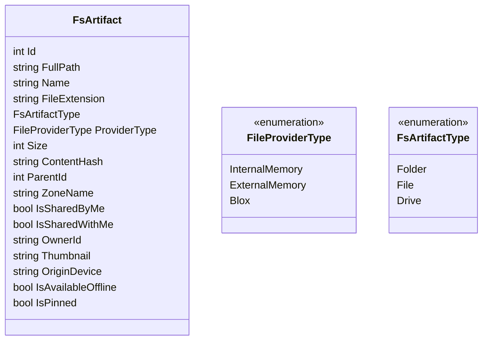
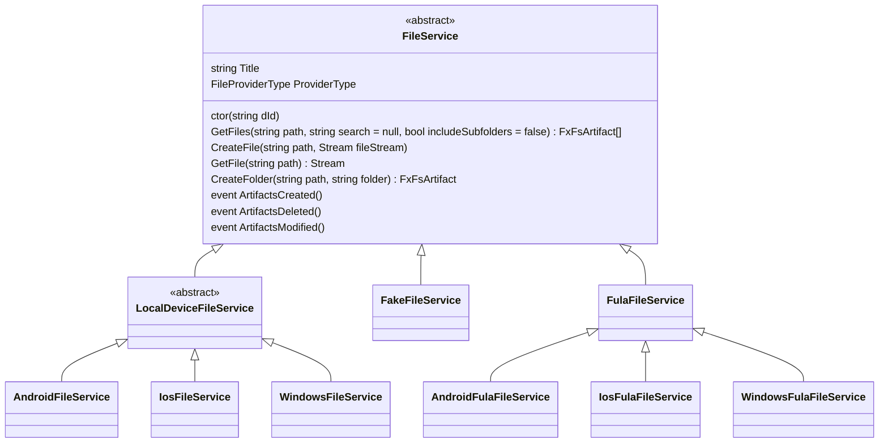
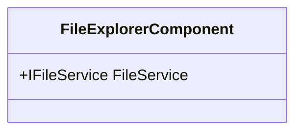

# Basic Models

```mermaid
classDiagram
class FsArtifact{
  int Id
  string FullPath
  string Name
  string FileExtension
  FsArtifactType
  FileProviderType ProviderType
  int Size
  string ContentHash
  int ParentId
  string ZoneName
  bool IsSharedByMe
  bool IsSharedWithMe
  string OwnerId
  string Thumbnail
  string OriginDevice
  bool IsAvailableOffline
  bool IsPinned
}

class FileProviderType{
  <<enumeration>>
  InternalMemory
  ExternalMemory
  Blox
}

class FsArtifactType{
  <<enumeration>>
  Folder
  File
  Drive
}
```

# FileService Architecture

```mermaid
classDiagram
FileService <|-- LocalDeviceFileService
LocalDeviceFileService <|-- AndroidFileService
LocalDeviceFileService <|-- IosFileService
LocalDeviceFileService <|-- WindowsFileService
FileService <|-- FakeFileService
FileService <|-- FulaFileService
FulaFileService <|-- AndroidFulaFileService
FulaFileService <|-- IosFulaFileService
FulaFileService <|-- WindowsFulaFileService

class FileService {
  <<abstract>>
  ctor(string dId)
  string Title
  FileProviderType ProviderType
  GetFiles(string path, string search = null, bool includeSubfolders = false) FxFsArtifact[]
  CreateFile(string path, Stream fileStream)
  GetFile(string path) Stream
  CreateFolder(string path, string folder) FxFsArtifact
  <<event>>
  event ArtifactsCreated()
  event ArtifactsDeleted()
  event ArtifactsModified()
}

class LocalDeviceFileService {
  <<abstract>>
  
}
```

# UI Components

```mermaid
classDiagram
class FileExplorerComponent {
  +IFileService FileService
}
```
