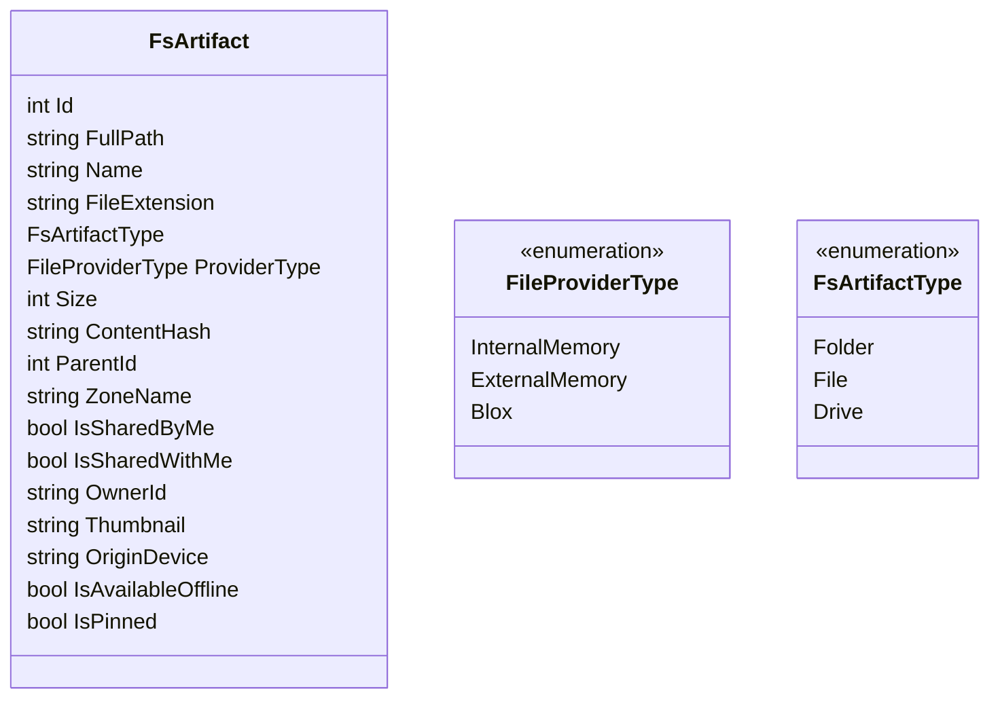
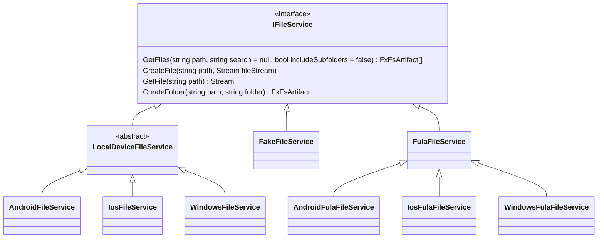
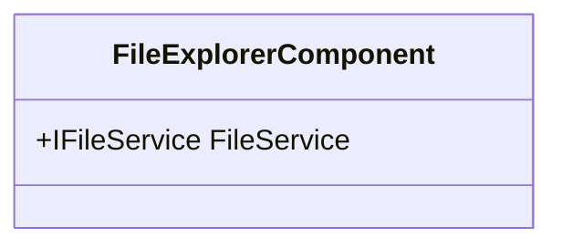

# Basic Models
The `FsArtifact` is an entity to describe a *File*, *Folder* or a *Drive* in the file system in any platform. The file system platform could be an android's internal memory, a windows drive, or a Blox Storage. All these file systems are stroing `FsArtifact`s which we may call them as **artifact**(s) in this document.

# FileService Architecture

# UI Components

