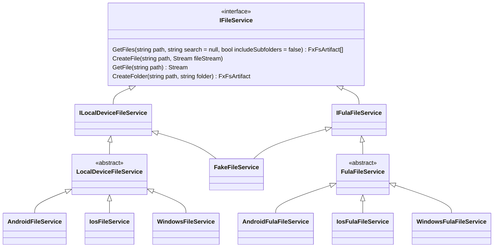
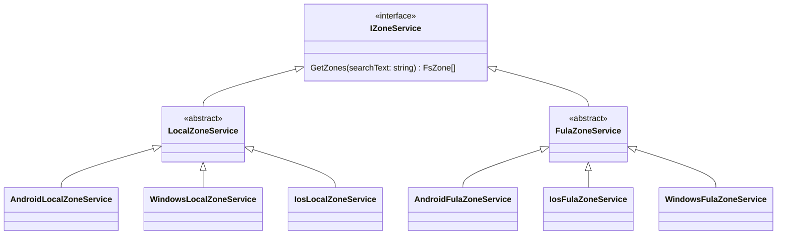

# Basic Models
The `FsArtifact` is an entity to describe a *File*, *Folder* or a *Drive* in the file system in any platform. The file system platform could be an android's internal memory, a windows drive, or a Blox Storage. All these file systems are stroing `FsArtifact`s which we may call them as **artifact**(s) in this document.

# FileService Architecture
To unify the development experience of facing with different file systems (Android, iOS, Widnows, Blox and ...) we use an abstraction called `IFileService`. This abstraction represents all the requirements that a typical file system should expose.

As you see, there are different implementations of `IFileService` for different platforms leveraging specialized API(s) of each specific platform.
Amongst these implementations `FakeFileService` is the interesting one for developers, as they can use it to easily test their application, removing all the barriers to setup a proper file system for testing purposes.

# ZoneService Architecture

## LocalZoneService
The `LocalZoneService` handles all the work required to support *Zone* on the device local storages.
The data for zones and their contents are being stored on local sqllite database.
## FulaZoneService
The `FulaZoneService` handles all the work required to support *Zone* for the Blox Files.
The data for zones and their contents are being stored on *Fula Network*. It uses `FulaZoneClient` sdk to communicate with the blockchain of Blox devices called Fula.
