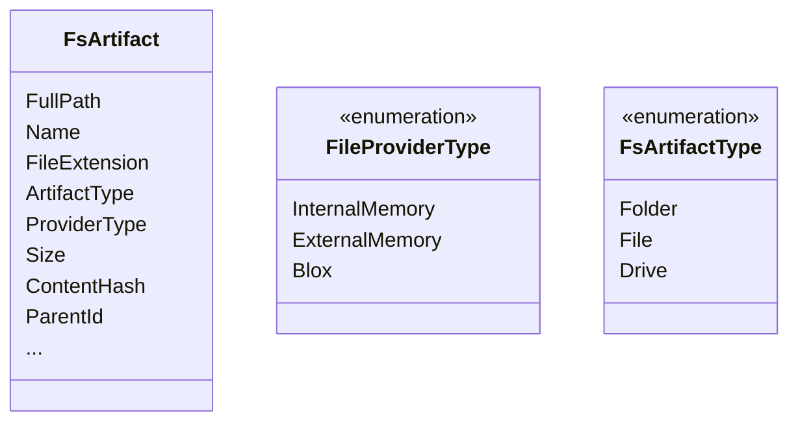
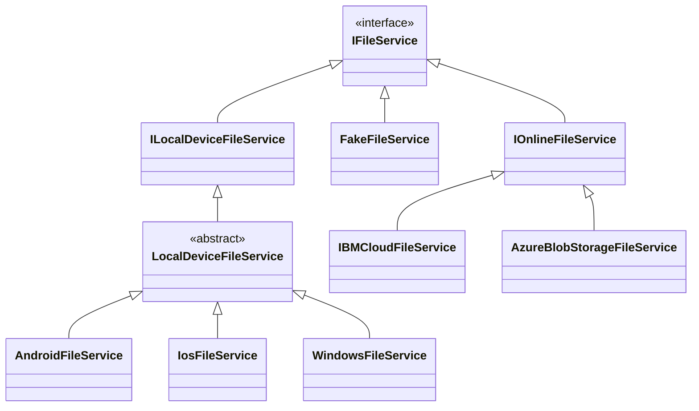

## What is a File Service?
In *Fx Files*, you work with files. But which files? The interesting fact is that *Fx Files* is designed in a way so it can work with any source of files. One  source of files (and the first came in mind of course) is the files in the local storage of device. But it is not limited to this. You can easily add support for other sources like Azure Storage, Google, IBM, FTP or any other source of files you can imagine.

To add support for a new source, you need only to write a `FileService` for it. For example if you want the app to support working with fiels on **Azure Blob Storage** you need to write a class named `AzureBlobStorageFileService` which implements `IFileService` interface like this:

```csharp
public class AzureBlobStorageFileService : IFileService
{
    // The implementation for Azure Blob Storage 
    // This implementation determines how to work with files on Azure
    // like copying, moving, deleting, searching and ...
}
```

Just by implementing about 20 methods of this interface, the application will support this source too.

You can see the full spec of the `IFileService` interface [here](https://github.com/functionland/fx-files/blob/main/src/Client/Shared/Services/Contracts/FileService/IFileService.cs).

Currently there will be needed some UI changes to add a tab to the application for this type. But in the future, there will be no need any work other than adding this file.

As an example you can see how we added support for working with local files by implementing `LocalDeviceFileService` class. The complete source code is [here](https://github.com/functionland/fx-files/blob/main/src/Client/Shared/Services/Implementations/FileService/LocalDeviceFileService.cs).

It would be something like:

```csharp
public partial class AzureStorageFileService : IFileService
{
    public override async Task CopyArtifactsAsync(IList<FsArtifact> artifacts, string destination, bool overwrite = false, Func<ProgressInfo, Task>? onProgress = null, CancellationToken? cancellationToken = null)
    {
        List<FsArtifact> ignoredList = new();

        await Task.Run(async () =>
        {
            ignoredList = await CopyAllAsync(artifacts, destination, overwrite, ignoredList, onProgress, true, cancellationToken);
        });

        if (ignoredList.Any())
        {
            throw new CanNotOperateOnFilesException(StringLocalizer[nameof(AppStrings.CanNotOperateOnFilesException)], ignoredList);
        }
    }

    // ...
}
```

To understand the architecture you should get familair with the basics of this design.

## Basic Models
The `FsArtifact` is an entity to describe a *File*, *Folder* or a *Drive* in the file system in any platform. The file system platform could be an android's internal memory, a windows drive, or a Blox Storage. All these file systems are strong `FsArtifact`s which we may call as **artifact**(s) in this document.




In our terminology, anything in the file system hierarchy (file, folder and drive) is an artifact. The `FsArtifact` (short for File System Artifact) describes these entities. So, to find out what kind of artifact it is, there is a property of `ArtifactType` of type `FsArtifactType` enum. You can check the code for it [here](https://github.com/functionland/fx-files/blob/main/src/Client/Shared/Models/FsArtifact.cs).

## FileService Architecture
To unify the development experience of facing with different file systems (Android, iOS, Windows, Blox and ...) we use an abstraction called `IFileService`. This abstraction represents all the requirements that a typical file system should expose.

As you see, there are different implementations of `IFileService` for different platforms leveraging specialized API(s) of each specific platform.
Amongst these implementations `FakeFileService` is the interesting one for developers, as they can use it to easily test their application, removing all the barriers to setup a proper file system for testing purposes.


