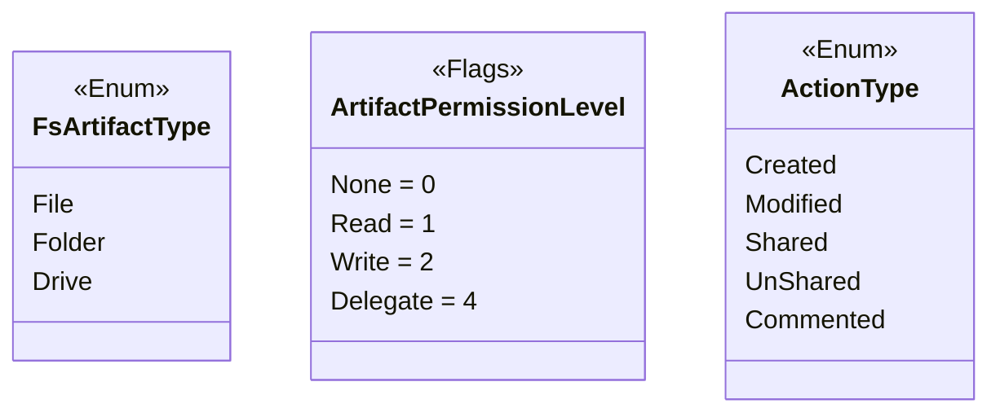
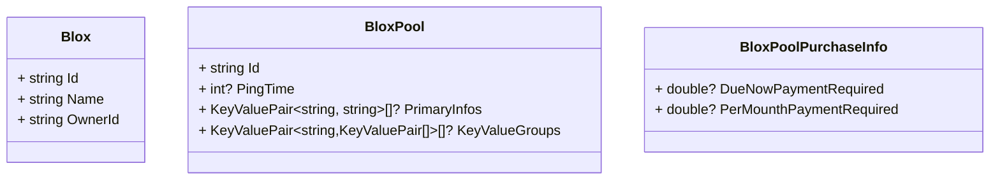
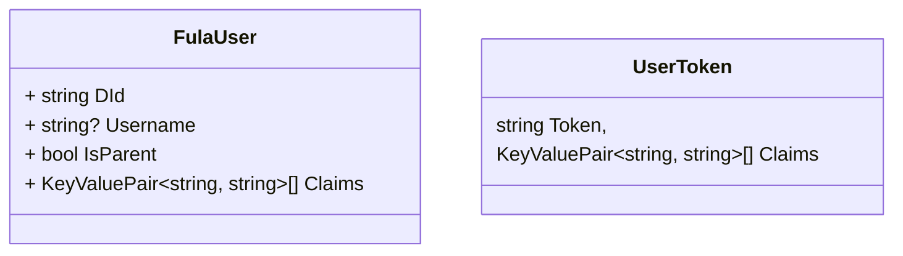
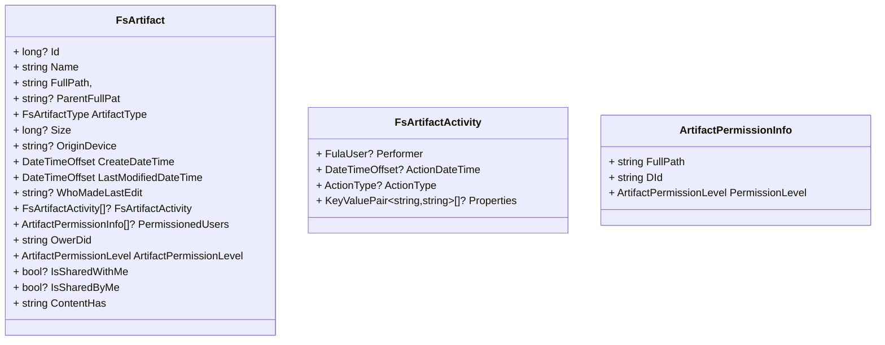
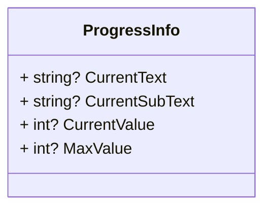
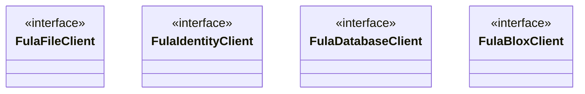

# FulaClient
## Enums


## Models
There are different models declared to use while working with FulaClient libraries. Here is a brief description about these models.
### Blox and Pool

### User

### File and Folder

### Actions


## Interfaces
### Introduction
There are four interfaces for dealing with Fula.
 - FulaFileClient
 - FulaIdentityClient
 - FulaDatabaseClient
 - FulaBloxClient
 



### FulaBloxClient
To work with Bloxes in the Fula network there is a `FulaBloxClient` which implements following interface.

```csharp
public interface IFulaBloxClient
{
    Task<List<Blox>> GetBloxesAsync(string token, CancellationToken? cancellationToken = null);
    Task<List<Blox>> GetBloxInvitationsAsync(string token, CancellationToken? cancellationToken = null);
    Task AcceptBloxInvitationAsync(string token, string bloxId, CancellationToken? cancellationToken = null);
    Task RejectBloxInvitationAsync(string token, string bloxId, CancellationToken? cancellationToken = null);
    Task<List<BloxPool>> GetMyPoolsAsync(string token, CancellationToken? cancellationToken = null);
    Task JoinToPoolAsync(string token, string poolId, PoolRole poolRole = PoolRole.Secondary, CancellationToken? cancellationToken = null);
    Task LeavePoolAsync(string token, string poolId, CancellationToken? cancellationToken = null);
    Task<BloxPoolPurchaseInfo> GetPoolPurchaseInfoAsync(string token, string poolId, CancellationToken? cancellationToken = null);
    IAsyncEnumerable<BloxPool> SearchPoolAsync(string token, CancellationToken? cancellationToken = null);
}
```

### FulaFileClient
To work with files in the Fula network there is a `FulaBloxClient` which implements following interface.

```csharp
public interface IFulaFileClient
{
    Task UploadFileAsync(string token, string path, string originDevice, Stream stream, Action<ProgressInfo>? onProgress = null, CancellationToken? cancellationToken = null);
    Task UpdateFileAsync(string token, string path, Stream stream, Action<ProgressInfo>? onProgress = null, CancellationToken? cancellationToken = null);
    Task AddFolderAsync(string token, string path, string folderName, string originDevice, CancellationToken? cancellationToken = null);
    Task<Stream> GetFileStreamAsync(string token, string filePath, Action<ProgressInfo>? onProgress = null, CancellationToken? cancellationToken = null);
    Task<List<string>> MoveArtifactsAsync(string token, IEnumerable<string> sourcePaths, string destinationPath, bool overwrite = false, Action<ProgressInfo>? onProgress = null, CancellationToken? cancellationToken = null);
    Task<List<string>> CopyArtifactsAsync(string token, IEnumerable<string> sourcePaths, string destinationPath, bool overwrite = false, Action<ProgressInfo>? onProgress = null, CancellationToken? cancellationToken = null);
    Task RenameFileAsync(string token, string filePath, string newName, CancellationToken? cancellationToken = null);
    Task RenameFolderAsync(string token, string folderPath, string newName, CancellationToken? cancellationToken = null);
    Task DeleteArtifactsAsync(string token, IEnumerable<string> sourcesPath, Action<ProgressInfo>? onProgress = null, CancellationToken? cancellationToken = null);
    IAsyncEnumerable<FsArtifact> GetChildrenArtifactsAsync(string token, string? path = null, CancellationToken? cancellationToken = null);
    IAsyncEnumerable<FsArtifact> SearchArtifactsAsync(string token, string? path = null, string? searchText = null, CancellationToken? cancellationToken = null);
    Task<FsArtifact> GetArtifactAsync(string token, string? path = null, CancellationToken? cancellationToken = null);
    Task SetPermissionArtifactsAsync(string token, IEnumerable<ArtifactPermissionInfo> permissionInfos, CancellationToken? cancellationToken = null);
    IAsyncEnumerable<FsArtifact> GetSharedByMeArtifacsAsync(string token, CancellationToken? cancellationToken = null);
    Task<FsArtifact> GetArtifactMetaAsync(string token, string path, CancellationToken? cancellationToken = null);
    Task<List<FsArtifactActivity>> GetActivityHistoryAsync(string token, string path, long? page = null, long? pageSize = null, CancellationToken? cancellationToken = null);
    Task<string> GetLinkForShareAsync(string token, string path, CancellationToken? cancellationToken = null);
}
```
**Note:** These methods `GetChildrenArtifactsAsync`, `SearchArtifactsAsync`,`GetArtifactAsync` and `GetSharedByMeArtifacsAsync` which return `FsArtifact` should fill the following properies to keep the contract.
 - `Id `
 - `Name`
 - `FullPath `
 - `ParentFullPath `
 - `FileExtension`
 - `ArtifactType`
 - `Size`
 - `LastModifiedDateTime`
 - `IsSharedWithMe`
 - `IsSharedByMe`
 - `ContentHash`

The rest of the `FsArtifact` properties will be provided by `GetArtifactMetaAsync`.

### FulaIdentityClient
To work with users and everything related to identity of the suers in the Fula network there is a `FulaIdentityClient` which implements following interface.

```csharp
public interface IFulaIdentityClient
{
    Task<UserToken> LoginAsync(string dId, string securityKey, CancellationToken? cancellationToken = null);
    Task<List<FulaUser>> GetUsersAsync(string token, IEnumerable<string> otherDids, CancellationToken? cancellationToken = null);
    Task<Stream> GetAvatarAsync(string token, string did, CancellationToken? cancellationToken = null);
}
```


### FulaDatabaseClient
To work with the GraphQL database provided by Fula network there is a `FulaDatabaseClient` which implements following interface.

```csharp
public interface IFulaDatabaseClient
{
    /// <summary>
    /// 
    /// </summary>
    /// <param name="name">Must be unique. like a guid or application environment...</param>
    /// <param name="cancellationToken"></param>
    /// <returns></returns>
    Task CreateInstanceAsync(string name, CancellationToken? cancellationToken = null);

    /// <summary>
    /// Every query operation takes a GraphQl query for <b>reading</b> operation. 
    /// </summary>
    /// <typeparam name="T"></typeparam>
    /// <param name="query">
    /// query {
    ///         read(input:{
    ///         collection: "profile",
    ///           filter:
    ///             {
    ///             age: { gt: 50}
    ///             }
    ///         }){
    ///           id
    ///           name
    ///           age
    ///         }
    ///       } 
    /// </param>
    /// <param name="cancellationToken"></param>
    /// <returns></returns>
    Task<List<T>> QueryAsync<T>(string token, string instance,string query,  CancellationToken? cancellationToken = null);

    /// <summary>
    /// Every mutation operation takes a query an values for create, update or delete operation
    /// </summary>
    /// <typeparam name="T"></typeparam>
    /// <param name="query">
    ///  mutation addProfile($values:JSON)
    ///  {
    ///      create(input:{
    ///      collection: "PinedArtifact",
    ///    values: $values
    ///      }){
    ///          id
    ///          path
    ///  }
    ///  }
    /// </param>
    /// <param name="values">
    ///     {
    ///        values: [{
    ///         id: 1,
    ///         path:"fula://home/1.jpg"
    ///          }]
    ///     }
    /// </param>
    /// <param name="cancellationToken"></param>
    /// <returns></returns>
    Task<List<T>> MutateAsync<T>(string token, string instance, string query, IEnumerable<T> values, CancellationToken? cancellationToken = null);
}
```
