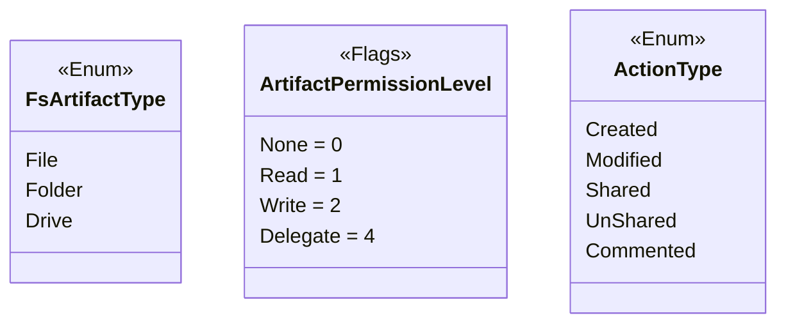
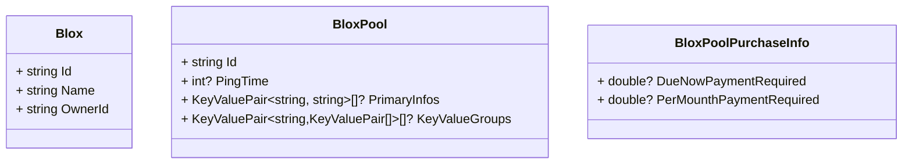
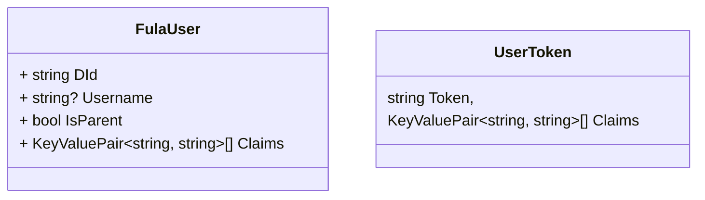
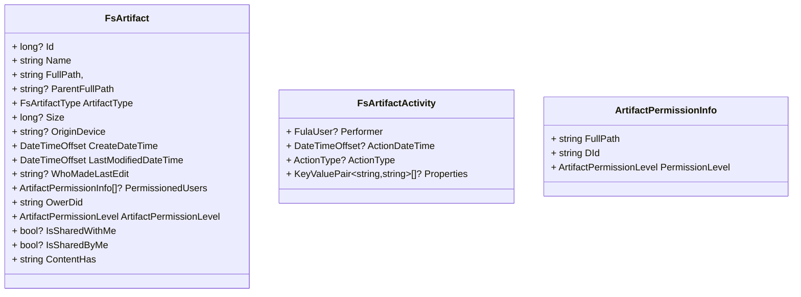
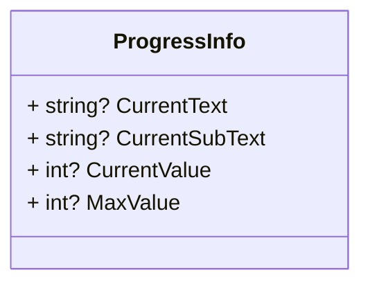
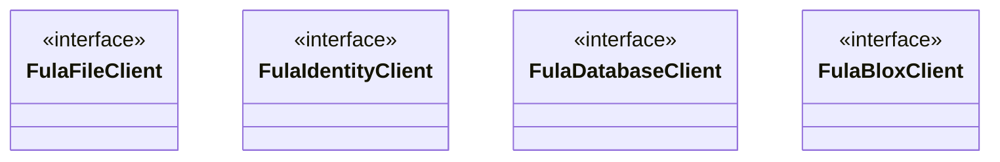

# FulaClient
## Enums
Source codes:
- [FsArtifactType](https://github.com/functionland/fx-files/blob/main/src/Client/Shared/Enums/FsArtifactType.cs)
- [ArtifactPermissionLevel](https://github.com/functionland/fx-files/blob/main/src/Client/Shared/Enums/ArtifactPermissionLevel.cs)
- [ActionType](https://github.com/functionland/fx-files/blob/main/src/Client/Shared/Enums/ActionType.cs)

## Models
There are different models declared to use while working with FulaClient libraries. Here is a brief description about these models.
### Blox and Pool
Source codes:
- [Blox](https://github.com/functionland/fx-files/blob/main/src/Client/Shared/Models/Blox.cs)
- [BloxPool](https://github.com/functionland/fx-files/blob/main/src/Client/Shared/Models/BloxPool.cs)
- [BloxPoolPurchaseInfo](https://github.com/functionland/fx-files/blob/main/src/Client/Shared/Models/BloxPoolPurchaseInfo.cs)

### User
Source codes:
- [FulaUser](https://github.com/functionland/fx-files/blob/main/src/Client/Shared/Models/FulaUser.cs)
- [UserToken](https://github.com/functionland/fx-files/blob/main/src/Client/Shared/Models/UserToken.cs)

### File and Folder
Source codes:
- [FsArtifact](https://github.com/functionland/fx-files/blob/main/src/Client/Shared/Models/FsArtifact.cs)
- [FsArtifactActivity](https://github.com/functionland/fx-files/blob/main/src/Client/Shared/Models/FsArtifactActivity.cs)
- [ArtifactPermissionInfo](https://github.com/functionland/fx-files/blob/main/src/Client/Shared/Models/ArtifactPermissionInfo.cs)

### Actions
Source codes:
- [ProgressInfo](https://github.com/functionland/fx-files/blob/main/src/Client/Shared/Components/Modal/ProgressModal/ProgressInfo.cs).

## Interfaces
### Introduction
There are four interfaces for dealing with Fula.
 - FulaFileClient
 - FulaIdentityClient
 - FulaDatabaseClient
 - FulaBloxClient
 

### FulaBloxClient
To work with Bloxes in the Fula network there is a [FulaBloxClient](https://github.com/functionland/fx-files/blob/main/src/Client/Shared/Services/Contracts/FulaClient/IFulaBloxClient.cs).

### FulaFileClient
To work with files in the Fula network there is a [FulaFileClient](https://github.com/functionland/fx-files/blob/main/src/Client/Shared/Services/Contracts/FulaClient/IFulaFileClient.cs).

**Note:** These methods `GetChildrenArtifactsAsync`, `SearchArtifactsAsync`,`GetArtifactAsync` and `GetSharedByMeArtifacsAsync` which return `FsArtifact` should fill the following properies to keep the contract.
 - `Id `
 - `Name`
 - `FullPath `
 - `ParentFullPath `
 - `FileExtension`
 - `ArtifactType`
 - `Size`
 - `LastModifiedDateTime`
 - `IsSharedWithMe`
 - `IsSharedByMe`
 - `ContentHash`

All of the `FsArtifact` properties will be provided by `GetArtifactMetaAsync`.
- `Id`
- `Name`
- `FullPath`
- `ParentFullPath`
- `ArtifactType`
- `Size`
- `OriginDevice`
- `CreateDateTime`
- `LastModifiedDateTime`
- `WhoMadeLastEdit`
- `PermissionedUsers`
- `OwerDId`
- `ArtifactPermissionLevel`
- `IsSharedWithMe`
- `IsSharedByMe`
- `ContentHas`

### FulaIdentityClient
To work with users and everything related to identity of the suers in the Fula network there is a [FulaIdentityClient](https://github.com/functionland/fx-files/blob/main/src/Client/Shared/Services/Contracts/FulaClient/IFulaIdentityClient.cs).

### FulaDatabaseClient
To work with the GraphQL database provided by Fula network there is a [FulaDatabaseClient](https://github.com/functionland/fx-files/blob/main/src/Client/Shared/Services/Contracts/FulaClient/IFulaDatabaseClient.cs).

