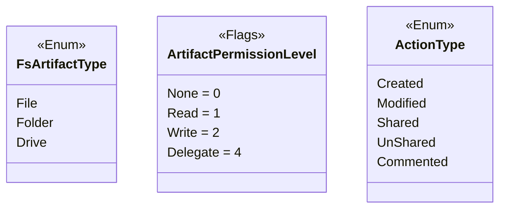
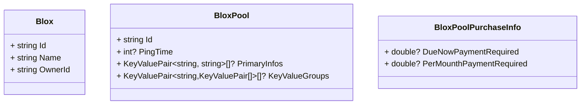
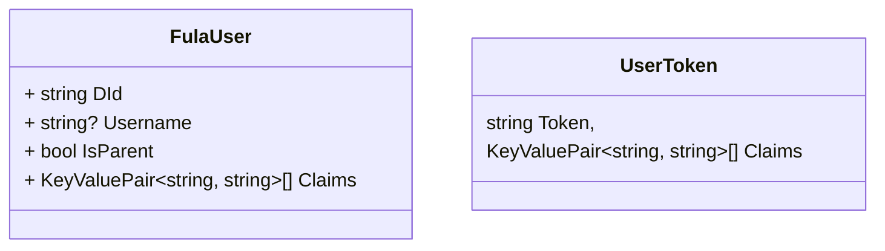
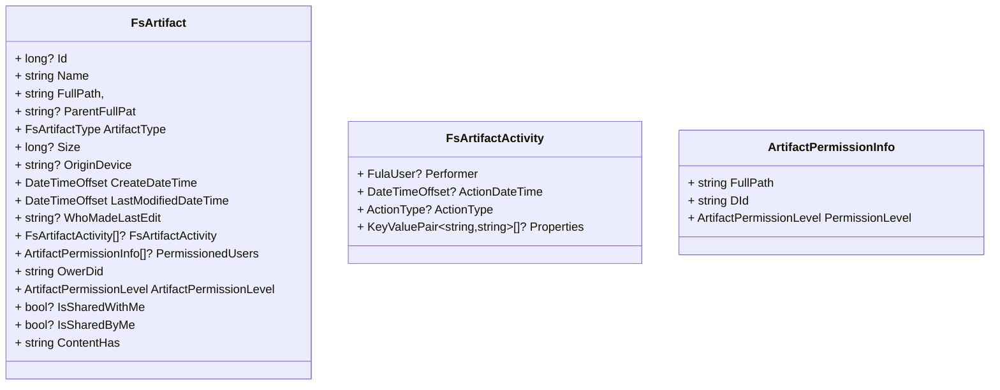
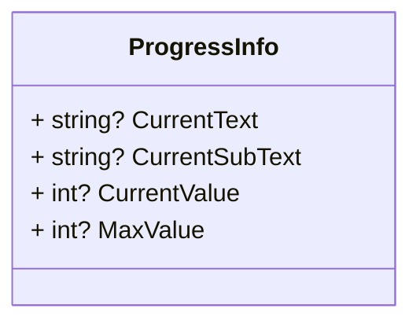

# FulaClient
## Enums


## Models
### Blox and Pool

### User

### File and Folder

### Actions


## Interfaces
### Introduction
There are four interfaces for dealing with Fula.
 - FulaBloxClient
 - FulaDatabaseClient
 - FulaFileClient
 - FulaIdentityClient

### FulaBloxClient
Everything we need to work with Blox and Pool within `Fx Files`


- Get all of my Bloxes.
```
Task<List<Blox>> GetBloxesAsync(string token, CancellationToken? cancellationToken = null);
```
- Get every Blox I invited in.
```
Task<List<Blox>> GetBloxInvitationsAsync(string token, CancellationToken? cancellationToken = null);
```
- Accept an invitation to a Blox.
```
Task RejectBloxInvitationAsync(string token, string bloxId, CancellationToken? cancellationToken = null);
```
- Reject an invitation to a Blox.
```
ask RejectBloxInvitationAsync(string token, string bloxId, CancellationToken? cancellationToken = null);
```
- Gel all of Pools that I'm in.
```
Task<List<BloxPool>> GetMyPoolsAsync(string token, CancellationToken? cancellationToken = null);
```
- Join to a Pool.
```
Task JoinToPoolAsync(string token, string poolId, PoolRole poolRole = PoolRole.Secondary, CancellationToken? cancellationToken = null);
```
- Leav from a Pool
```
Task LeavePoolAsync(string token, string poolId, CancellationToken? cancellationToken = null);
```
- Get purchase information of a Pool.
```
Task<BloxPoolPurchaseInfo> GetPoolPurchaseInfoAsync(string token, string poolId, CancellationToken? cancellationToken = null);
```
- Get all pool in Fula. You can read result item by item and you don't need to wait for all the results.
```
 IAsyncEnumerable<BloxPool> SearchPoolAsync(string token, CancellationToken? cancellationToken = null);
``` 

### FulaFileClient
Work with files and folders in Fula

- Upload a file on Fula.
```
Task UploadFileAsync(string token, string path, string originDevice, Stream stream, Action<ProgressInfo>? onProgress = null, CancellationToken? cancellationToken = null);
```
- Update a file content.
```
Task UpdateFileAsync(string token, string path, Stream stream, Action<ProgressInfo>? onProgress = null, CancellationToken? cancellationToken = null);
```
- Add a folder.
```
Task AddFolderAsync(string token, string path, string folderName, string originDevice, CancellationToken? cancellationToken = null);
```
- Get content of a file as a Stream.
```
Task<Stream> GetFileStreamAsync(string token, string filePath, Action<ProgressInfo>? onProgress = null, CancellationToken? cancellationToken = null);
```
- Move some files and folders to another destination.
```
Task<List<string>> MoveArtifactsAsync(string token, IEnumerable<string> sourcePaths, string destinationPath, bool overwrite = false, Action<ProgressInfo>? onProgress = null, CancellationToken? cancellationToken = null);
```
- Copy some files and folders to another destination.
```
Task<List<string>> CopyArtifactsAsync(string token, IEnumerable<string> sourcePaths, string destinationPath, bool overwrite = false, Action<ProgressInfo>? onProgress = null, CancellationToken? cancellationToken = null);
```
- Rename a file.
```
Task RenameFileAsync(string token, string filePath, string newName, CancellationToken? cancellationToken = null);
```
- Rename a folder.
```
Task RenameFolderAsync(string token, string folderPath, string newName, CancellationToken? cancellationToken = null);
```
- Delete some files and folders.
```
Task DeleteArtifactsAsync(string token, IEnumerable<string> sourcesPath, Action<ProgressInfo>? onProgress = null, CancellationToken? cancellationToken = null);
```
- Get all item in a folder.
```
IAsyncEnumerable<FsArtifact> GetChildrenArtifactsAsync(string token, string? path = null, CancellationToken? cancellationToken = null);
```
- Find files and folders with part of their name.
```
IAsyncEnumerable<FsArtifact> SearchArtifactsAsync(string token, string? path = null, string? searchText = null, CancellationToken? cancellationToken = null);
```
- Get minimal information of a folder or file.
```
Task<FsArtifact> GetArtifactAsync(string token, string? path = null, CancellationToken? cancellationToken = null);
```
- Set permission to some folders and fildes for people.
```
Task SetPermissionArtifactsAsync(string token, IEnumerable<ArtifactPermissionInfo> permissionInfos, CancellationToken? cancellationToken = null);
```
- Get all folders and files that I share.
```
IAsyncEnumerable<FsArtifact> GetSharedByMeArtifacsAsync(string token, CancellationToken? cancellationToken = null);
```
- Get more information of a file or folder.
```
Task<FsArtifact> GetArtifactMetaAsync(string token, string path, CancellationToken? cancellationToken = null);
```
- Get all activity history of a folder or file.
```
Task<List<FsArtifactActivity>> GetActivityHistoryAsync(string token, string path, long? page = null, long? pageSize = null, CancellationToken? cancellationToken = null);
```
- Get link of a file or folder for share.
```
Task<string> GetLinkForShareAsync(string token, string path, CancellationToken? cancellationToken = null);
```

```GetChildrenArtifactsAsync```, ```SearchArtifactsAsync```,```GetArtifactAsync``` and ```GetSharedByMeArtifacsAsync``` only fills the following properies.
```
Id 
Name
FullPath 
ParentFullPath 
FileExtension
ArtifactType
Size
LastModifiedDateTime
IsSharedWithMe
IsSharedByMe
ContentHash
```
The rest of the properties are returned in ```GetArtifactMetaAsync```

### FulaIdentityClient
Work with users and authentication.

- Login to Fula and get token and claims.
```
Task<UserToken> LoginAsync(string dId, string securityKey, CancellationToken? cancellationToken = null);
```
- Get some users with their DId's.
```
Task<List<FulaUser>> GetUsersAsync(string token, IEnumerable<string> otherDids, CancellationToken? cancellationToken = null);
```
- Get a user avatar with DId
```
Task<Stream> GetAvatarAsync(string token, string did, CancellationToken? cancellationToken = null);
```

### FulaDatabaseClient
Work with GraphQL database and it's entities like PinedArtifact.
- Create an instance of a GraphQL database.
```
Task CreateInstanceAsync(string name, CancellationToken? cancellationToken = null);
```
- Send a GraphQL query.
```
Task<List<T>> QueryAsync<T>(string token, string query, string instance, CancellationToken? cancellationToken = null);
```
- Send a GraphQL mutation.
```
Task<List<T>> MutateAsync<T>(string token, string query, IEnumerable<T> values, CancellationToken? cancellationToken = null);
```
