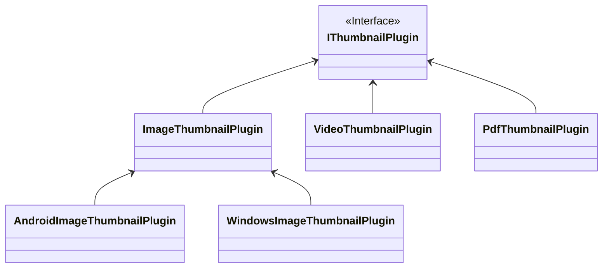

# Thumbnail System Overview

## What is a Thumbnail?
When using FxFiles app, you see that some files has thumbnails. For example pictures are of those files that you will see a thumbnail for each one in the list and grid mode.

But which file will show like a thumbnail and which one is not, this is the question we will explain in this document.

## Thumbnail Plugin
Essentialy, for a file type (like *.jpg* or *.pdf*), you need to have a **Thumbnail Plugin** so it can be convertible it to a thumbnail picture.

A thumbnail plugin is a class which implements `IThumbnailPlugin`.

```csharp
interface IThumbnailPlugin
{
    bool IsJustFilePathSupported { get;  }
    bool IsSupported(string extension);
    Task<Stream> CreateThumbnailAsync(Stream? inputStream, string? filePath, ThumbnailScale thumbnailScale, CancellationToken? cancellationToken = null);
}
```

We are going to create a thumbnail plugin for images called `ImageThumbnailPlugin` step by step.

The first step is to indicate what types of files does this pluggin support. This should be done by implementing `IsSupported` method.

```csharp
public class ImageThumbnailPlugin
{
    bool IsSupported(string extenstion) 
        => new string[] {"jpg", "png", "bmp"}.Contains(extension);
    // ...
}
```

Then we should write the thumbnail creation logic. To create a thumbnail, the pluggin accepts whether a *stream* or a *filename* as input. Normally your plugin should support both, but in some cases, some plugins can not work with streams. They just work with a file stored on disk. For this kind of plugins you should indicate this restriction by implementing `IsJustFilePathSupported`:

```csharp
public class ImageThumbnailPlugin
{
    // Just do this if your plugin has a restriction for working with streams. Otherwise left it false.
    bool IsJustFilePathSupported => true;
    // ...
}
```
Finally you should write the logic of thumbail creation by implementing the `CreateThumbnailAsync`:

```csharp
public class ImageThumbnailPlugin
{
    // ...
    Task<Stream> CreateThumbnailAsync(
        Stream? inputStream, 
        string? filePath, 
        ThumbnailScale thumbnailScale, 
        CancellationToken? cancellationToken = null);
    {
        // Write your logic to convert input stream or filepath to a thubmnail and return its stream.
    }
}
```
For the thumbnail creation logic you can use any platform-specific library or you can write it general. If you want to use a platfrom-specific library like `ThumbnailUtils` for android, you should write it in the `Android` folder and register it in the android's `ServiceCollectionExtensions`, otherwise register it in the share one:

```csharp
// In the shared folder
services.AddTransient<IThumbnailPlugin, ImageThumbnailPlugin>();
```
or for the platform specific plugins:
```csharp
// In the android folder
services.AddTransient<IThumbnailPlugin, AndroidImageThumbnailPlugin>();
// In the windows folder
services.AddTransient<IThumbnailPlugin, WindowsImageThumbnailPlugin>
```

Congratulations! All done. You have added a new plugin to FxFiles now. Form now on, the appliation supports thubmails for images.

You can design the hierarchy of plugins to utilize as much as code sharing you want.



In this example we have two platform-agnostic plugins: `VideoThumbailPlugin` and `PdfThumbnailPlugin` and the platform-specific plugin for images which are implemented in 3 classes: `ImageThumbailPlugin`, `AndroidThumbailPlugin` and `WindowImageThumbailPlugin`.